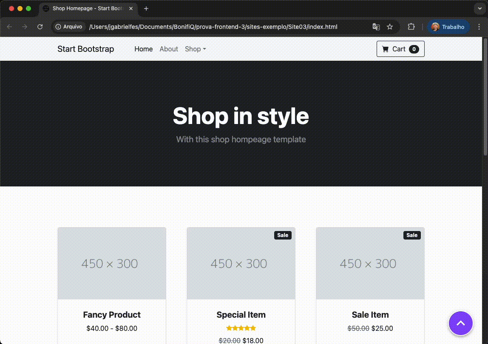

# 🧪 Prova Prática – Desenvolvedor Front-End

## 🧠 Objetivo

Avaliar a capacidade do candidato em desenvolver e integrar um widget em uma página web, consumindo dados de uma API e utilizando tecnologias modernas como React.

---

## 📋 Instruções Gerais

Você deve entregar:

1. Um arquivo JavaScript que será incluído em qualquer site para carregar um widget contendo um iFrame.
2. Um projeto React utilizando o framework Vite + TypeScript com a página a ser carregada no widget.
3. As instruções de como executar e testar a solução.

---

## ✅ Requisitos

### 1. JavaScript para inserir o widget (arquivo externo)

Desenvolva um script JS que:

- Cria um botão flutuante fixo no canto inferior direito da tela (como um botão de chat).
- Ao clicar no botão, um iFrame deve aparecer com o conteúdo da aplicação React.
- O botão deve permitir abrir/fechar o widget.
- O script deve ser facilmente incorporado via `` em qualquer site.

> 💡 O `window.loggedUserId` estará definido na página principal com o valor do ID do usuário logado (por exemplo: `window.loggedUserId = 2`).

---

### 2. Aplicação React

Você deverá criar uma aplicação que será exibida dentro do iFrame. Essa aplicação deve:

- Ao carregar, ler o valor de `window.parent.loggedUserId` via `postMessage`.
- Usar esse ID para fazer uma requisição `GET` para:
  `https://jsonplaceholder.typicode.com/users/<ID>`
- Exibir na tela os seguintes dados do usuário retornado:
  - Nome
  - E-mail
- Usar o mesmo ID para fazer uma requisição `GET` para:
  `https://jsonplaceholder.typicode.com/posts?userId=<ID>`
- Exibir na tela os posts realizados pelo usuário contendo:
  - Título (`title`)
  - Conteúdo (`body`)

> ⚠️ Importante: a aplicação React precisa funcionar mesmo rodando em um iFrame hospedado em outro domínio.

---

### 3. Design & UX

- O widget pode ser simples, mas deve ser utilizável em desktop e mobile.
- O widget deve cobrir no máximo **320px de largura** e **600px de altura**.
- Sinta-se livre para utilizar bibliotecas com componentes prontos ou de estilização.
- Deve haver um botão de **fechar** dentro do próprio widget.

---

## 🧪 Critérios de Avaliação

| Critério                          | Peso |
|----------------------------------|------|
| Funcionalidade completa          | 40%  |
| Organização do código            | 20%  |
| Uso adequado de React e JS       | 20%  |
| UX e comportamento do widget     | 10%  |
| Clareza nas instruções de uso    | 10%  |

---

## 🚀 Extras (não obrigatórios, mas contam pontos)

- Adicionar tratamento de erro caso o ID do usuário seja inválido.
- Fazer loading enquanto a API é chamada.
- Testes unitários

---

## 👾 Exemplos

---

## 📦 Entrega

- Basta fazer um pull-request nesse repositório contendo seu nome completo no título do mesmo.

---

Boa sorte! 🍀
